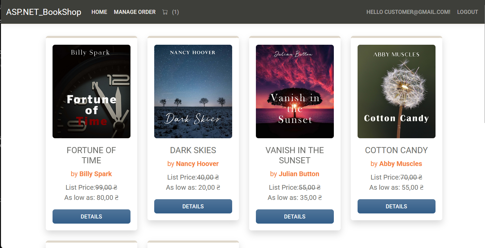
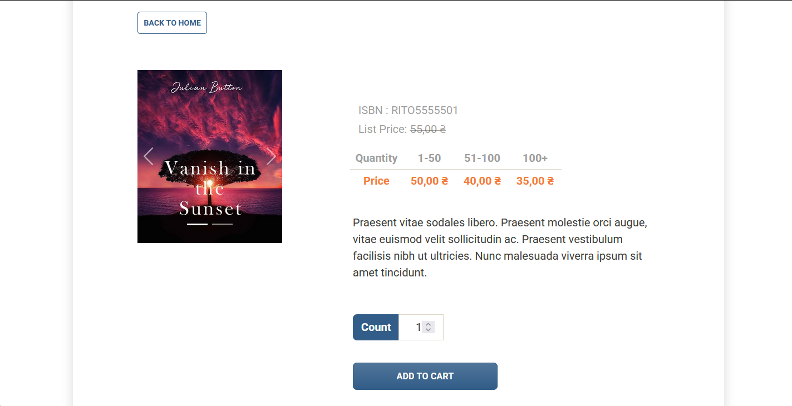
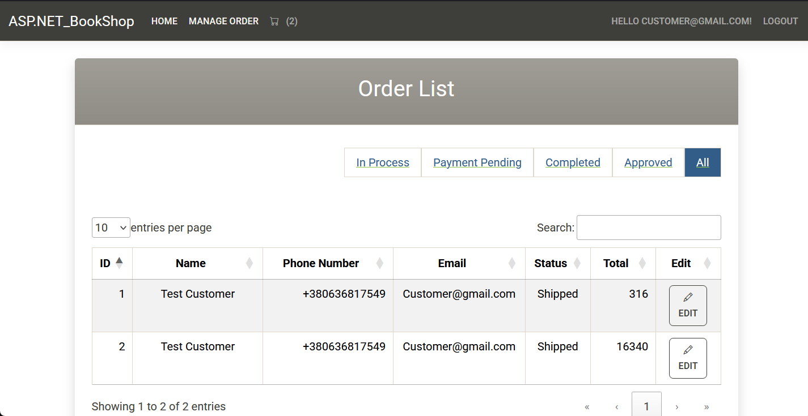
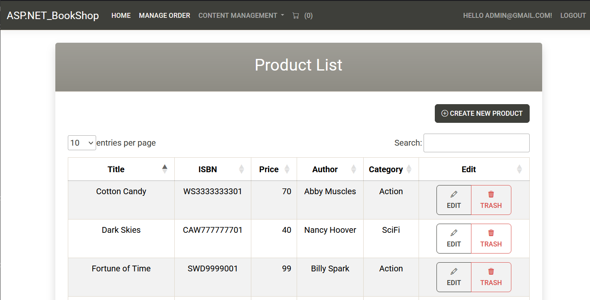
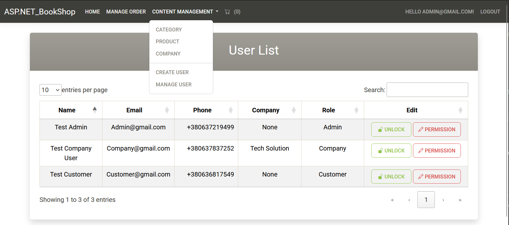

# E-Commerce Application with ASP.NET Core MVC

## Overview
This is an E-Commerce Application built using ASP.NET Core MVC, featuring a user registration and login system powered by ASP.NET Identity.
It was created as a practice project and will not receive updates

## Features
- 🔑 **User Authentication**: Register, login, and manage user sessions with **ASP.NET Identity**  
- 🔒 **Security**: Strong password requirements & optional **Two-Factor Authentication (2FA)**  
- 🛒 **E-Commerce Ready**: User profiles with customizable personal information  
- 🗄 **Database Integration**: User records stored and managed in **SQLite**  
- 📊 **User Management**: Admin-level access to examine and manage users  

## Technologies Used
- **ASP.NET Core MVC**
- **ASP.NET Identity**
- **Entity Framework Core**
- **SQLite**
- **Bootstrap (for UI styling)**
- 
## Images

